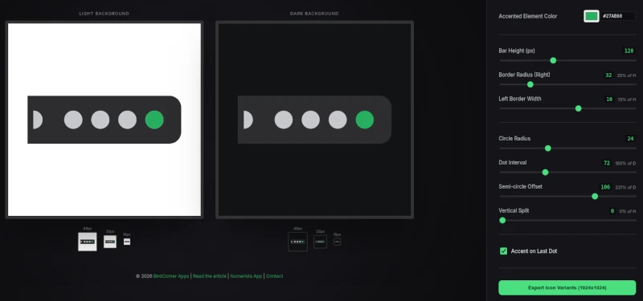

Need to design a quality app icon without graphic design experience?
Here is a simple process for you.

<!--more-->

This article is about designing an icon for the [Numerista app](https://numerista.app/) that I’m building. The app is a practical daily system to develop numeric memory.

## What makes a good icon

It's as simple as this:

> If someone doesn’t know what the app does, but sees its icon every day for a month, does the icon earn trust?

## The constraints

> There is nothing more frightening than a blank piece of paper

This is why constraints is a blessing. 

The app icons have not one, but two constraints: size and colors.

The icons on the mobile home screen are small. The web favicons are even smaller and can go down to 16x16px in size. A good icon must gracefully survive shrinking.

There are tinted (iOS/iPadOS) and themed (Android) screen modes which strip all the original colors from the app icons. The app icon must still look nice in one solid color (not counting the background.)

This discards text, gradients, shadows, smaller decorative details, and other noise.

All this makes abstract **glyphs** the best candidates. As a rule of thumb:

- 1 bold primary shape  
- 1-2 bold secondary elements (optional)  
- minimal color palette: one for the shape, one for the elements, and one for the accent element

## The styles

If you check your mobile home screen, each app icon most likely will be: *literal*, *metaphorical*, *symbolic*, or *decorative*. Talking about **decorative** icons is above my paygrade, I’m leaving it to brand and graphic designers.

### Literal

The easiest to come up with is the **literal** one. For a number memory app this would be an image of the brain and some numbers. This is a good choice for a school assignment or a calculator. In a production app it signals sloppiness: the developer couldn’t be bothered about the first thing the user interacts with. It gets in the way of building trust, because chances are there are other neglected areas in the app, such as proper user data protection.

### Metaphor

A better option is a **metaphor**. For Numerista it would be some animal known for its memory or craftyness or something related to memory techniques, like a peg. The problems are:

- the metaphoric image is too complex considering the size/color constraints  
- AI is currently not very good at producing complex vector images  
- there’s a risk of ending up with a cliché

### Symbolic

The next level is **symbolic**, where you distill your metaphorical image
almost to the basic shape (think of The Bull by Pablo Picasso).
Slight imperfections (rounded ends, small offsets) are often enough to avoid sterility.

I ended up with a peg distilled to a bar with one end slightly rounded, and added four big dots. This *hints* at a four-digit pin number, securely stored using a mnemonic device, but the beauty of this restrained geometry is that it lets the user interpret it differently in their own personal way.

## Design process

Use this prompt to brainstorm ideas and find a promising design:

> **Role**  
>  Act as a senior graphic designer experienced in brand and app icon design.
>
> **App description**  
>  \[APP DESCRIPTION\]
>
> **Task**  
>  Design **12 SVG app icon concepts** as symbolic glyphs suitable for use on web, iOS, and Android.
>
> **Design principles**
>
> * Prefer **symbolic abstraction** over literal depiction.
> * Icons should suggest structure, system, and reliability rather than explain functionality.
> * Avoid numbers, text, characters, or mascots.
>
> **Concept development**
>
> * Select **1–3 metaphors** aligned with the app’s purpose (e.g. structure, placement, recall).
> * Reduce each metaphor to a main simple geometric forms and optionally one or two secondary elements.
> * Explore variations that feel like siblings, not decorative alternatives.
>
> **Constraints**
>
> * Must remain clear at very small sizes (favicon scale).
> * Must survive monochrome rendering (Android themed icons).
> * Minimal shapes, no gradients, shadows, textures, or fine detail.
> * Clean, editable SVG output.
>
> **Example reference direction (not to copy)**  
>  A calm, industrial glyph built from:
> * a horizontal peg-like base shape
> * a subtly rounded end
> * four circular elements aligned to the base
>
> **Quality filter**  
>  Apply this test to every concept:  
>  *If a user sees this icon daily for a month without knowing the app, does it quietly earn trust?*  
>  Reject anything cute, clever, loud, or gimmicky.
>
> **Output**
>
> 12 standalone SVG icons, each labeled with the explanation of the underlying metaphor.

Then you might want to tweak it to find the most appealing sizes,
proportions, relative positions, and colors of the icon elements.
You may also wish to see if the secondary elements make the icon better.

Previously you would need to open your [Inkscape](https://inkscape.org/),
or whatever you use for vector graphics editing.
But now you can build a single-page tweaker app like this:



It's live, and you can try it yourself:
[Numerista icon tweaker](https://numerista.app/icon.html)

Here's the prompt you can reuse for your own app icons.
Replace the **text in bold** and the original icon SVG,
and ask your favorite coding agent to do the job.

> ### Objective
> 
> Create a single-page, premium HTML5/JavaScript application for visually tweaking and exporting a specific "parametric" app icon. The UI must feel like a modern design tool (lush dark theme, glassmorphism, precise controls).
> 
> The original app icon is as follows:
> 
> ```svg
> 
> <svg width="512" height="512" viewBox="0 0 512 512"
>  xmlns="http://www.w3.org/2000/svg">
>   <defs>
>     <!-- Clip path to ensure the first dot remains a semi-circle -->
>     <clipPath id="default_semiClip">
>       <rect x="67.2" y="0" width="409.6" height="512"/>
>     </clipPath>
>     
>     <!-- Mask to punch holes through the peg bar -->
>     <mask id="default_pegMask">
>       <rect x="51.2" y="0" width="409.6" height="512" fill="white"/>
>       <g clip-path="url(#default_semiClip)">
>         <circle cx="67.2" cy="256" r="24" fill="black"/>
>       </g>
>       <circle cx="173.2" cy="256" r="24" fill="black"/>
>       <circle cx="245.2" cy="256" r="24" fill="black"/>
>       <circle cx="317.2" cy="256" r="24" fill="black"/>
>       <circle cx="389.2" cy="256" r="24" fill="black"/>
>     </mask>
>   </defs>
> 
>   <!-- The Peg (Main Element) -->
>   <rect x="19.2" y="192" width="441.6" height="128"
>    rx="32" ry="32" fill="#2D2D2F" mask="url(#default_pegMask)"/>
> 
>   <!-- The Semi-circle (Accented Secondary element) -->
>   <circle cx="67.2" cy="256" r="24" fill="#27AE60"
>     clip-path="url(#default_semiClip)"/>
> 
>   <!-- The Four Regular Dots (Secondary elements) -->
>   <circle cx="173.2" cy="256" r="24" fill="#C6C9CD"/>
>   <circle cx="245.2" cy="256" r="24" fill="#C6C9CD"/>
>   <circle cx="317.2" cy="256" r="24" fill="#C6C9CD"/>
>   <circle cx="389.2" cy="256" r="24" fill="#C6C9CD"/>
> </svg>
> 
> ```
> 
> ### UI & Visual Aesthetics
> 
> * Layout: A full-screen split view.
>   * Left (Preview Area): A large, centered canvas displaying the icon in two state panels simultaneously: Light Background and Dark Background.
>   * Right (Controls Panel): A fixed-width (380px), scrollable sidebar with a semi-transparent glass background (backdrop-filter: blur(20px)).
> * Typography: Use 'Outfit' (Sans-serif) for headings and 'Inter' for labels and UI text.
> * Theme: Saturated dark theme (\#0c0c0e background). Use high-contrast accent colors (\#4ade80 / Lush Green) for sliders and active elements.
> * Micro-Previews: Below each main 512px preview, show three "scaled" versions (48px, 32px, 16px) to test legibility at small sizes. Use CSS/browser scaling for consistency.
> * Preview background: use white background color for the Light icon previews and \#0c0c0e for the Dark
> * Footer: A centered footer in the left panel with links (BirdCorner Apps, Numerista App, LinkedIn) and a dynamic copyright year.
> 
> ### SVG Rendering Engine (The Core Logic)
> 
> The icon consists of the main element (**"Peg": a rounded bar**) and secondary elements (**five round "Dots", the first being a semi-circle**).
> 
> * Geometric Constants:
>   * Padding: 10% on each size of the canvas.
>   * Resolution: Base preview at 512x512; Export at 1024x1024.
> * Masking & Clipping:
>   * Use an SVG Mask to punch holes in the shapes of the secondary elements (**dots**) through the main element (**peg**) where the secondary elements overlap with the main one.
>   * **The first dot is a semi-circle; use a separate clipPath to ensure both the dot itself and the hole in the peg are perfectly half-circles.**
> * Unified Generator: Implement a single function for both preview and the export
> * getIconSvg(params, scale, options) that calculates all coordinates (X, Y, radius) relative to a scale factor.
> 
> ### Parametric Controls
> 
> Group controls into logical sections. The range sliders should display absolute size as well as relative percentage size (real-time). The relative one should have the most intuitive base (e.g. the distance between dots is the percentage of the dot radius):
> 
> * **Bar Settings:**
>   * **Bar Height: Vertical thickness of the peg.**
>   * **Border Radius: Rounding of the peg ends.**
>   * **Left Border Width: Moves the dot grouping relative to the clip edge.**
> * **Dot Settings:**
>   * **Circle Radius: Size of the dot "holes".**
>   * **Dot Interval: Spacing between the four regular dots.**
>   * **Semi-circle Offset: Space between the semi-circle and the first dot.**
>   * **Vertical Split: Vertical offset. Peg moves down, dots move up by this amount.**
> * **Toggles:**
>   * **Show Semi-circle: Hides the semi-circle and fills its hole.**
>   * **Add Accent: Toggles coloring of a specific dot.**
>   * **Accent on Last Dot: Choose whether the Semi-circle or the 4th dot receives the accent color.**
> 
> ### Coloring Logic
> 
> * Base Color: The color of the main element.
> * Secondary Color: The default color of the secondary elements.
> * Accent Color: The specific color for the "accented" secondary elements.
> * **Conditional Rule: If Vertical Split \> 0, regular dots should adopt the Base Color (appearing as pure cutouts), otherwise they use Secondary Color.**
> * Picker Sync: All color pickers must have an adjacent hex text input that stays perfectly in sync (bi-directional mapping).
> 
> ### Export Functionality
> 
> A dedicated button to generate and download four PNG variants at 1024x1024 resolution:
> 
> 1. *base*: Icon on a transparent background.
> 2. *white*: Icon on a solid white background.
> 3. *monochrome*: The peg only (in baseColor) with transparent holes where dots are.
> 4. *tinted*: A specific variant using a vertical gradient (\#313131 to \#141414) and forcing all secondary elements to use Secondary Color (no Accent Color).
> * Naming Convention: app\_icon.prod.{variant-name}.png.
> 
> ### Implementation Notes for the AI
> 
> * Use Vanilla JavaScript (ES6+). No external dependencies.
> * Handle SVG blobs and DataURLs carefully for high-resolution canvas rendering.
> * Ensure all IDs for mask and clipPath are unique between the light and dark previews to avoid rendering conflicts.

## Closing thought

If you are technical and feel blocked by "design taste," a constrained, symbolic,
this approach can be surprisingly effective.
You don’t need to become a designer.
A clear system of a few principles would suffice.
